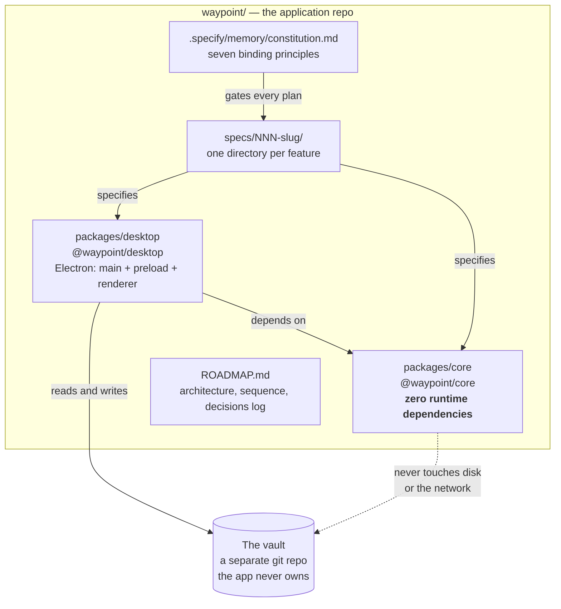
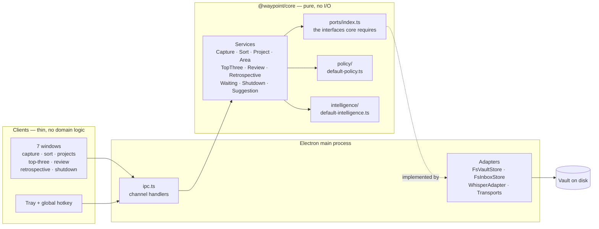
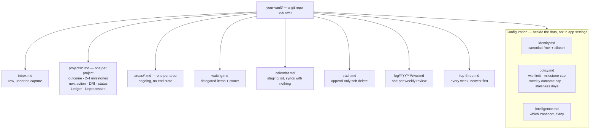
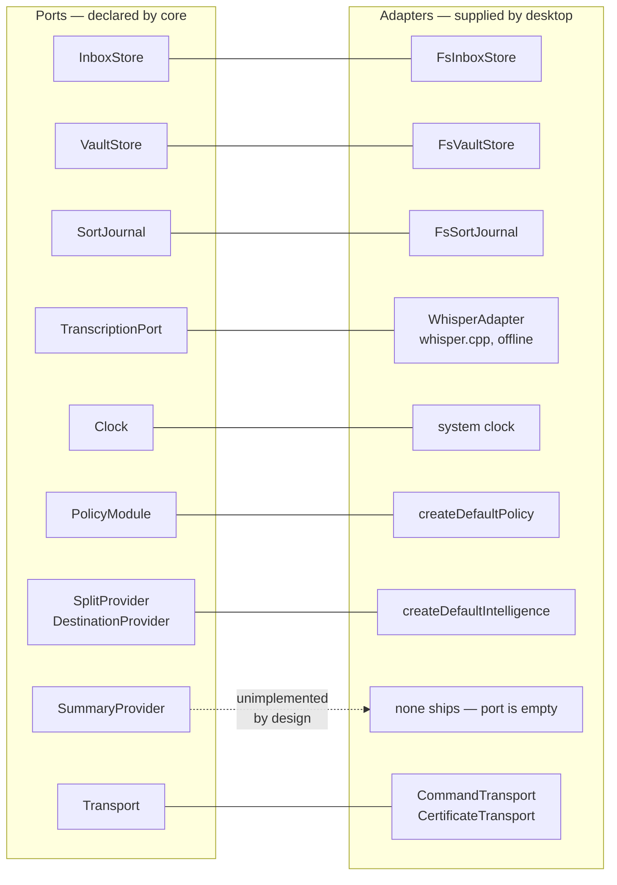
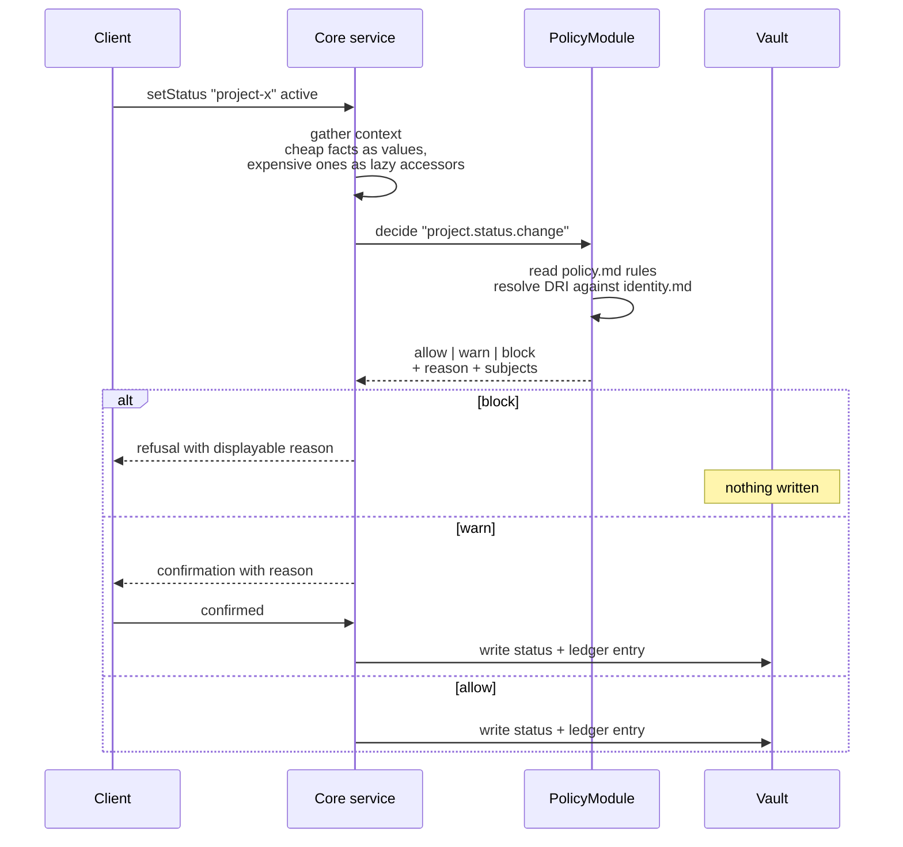
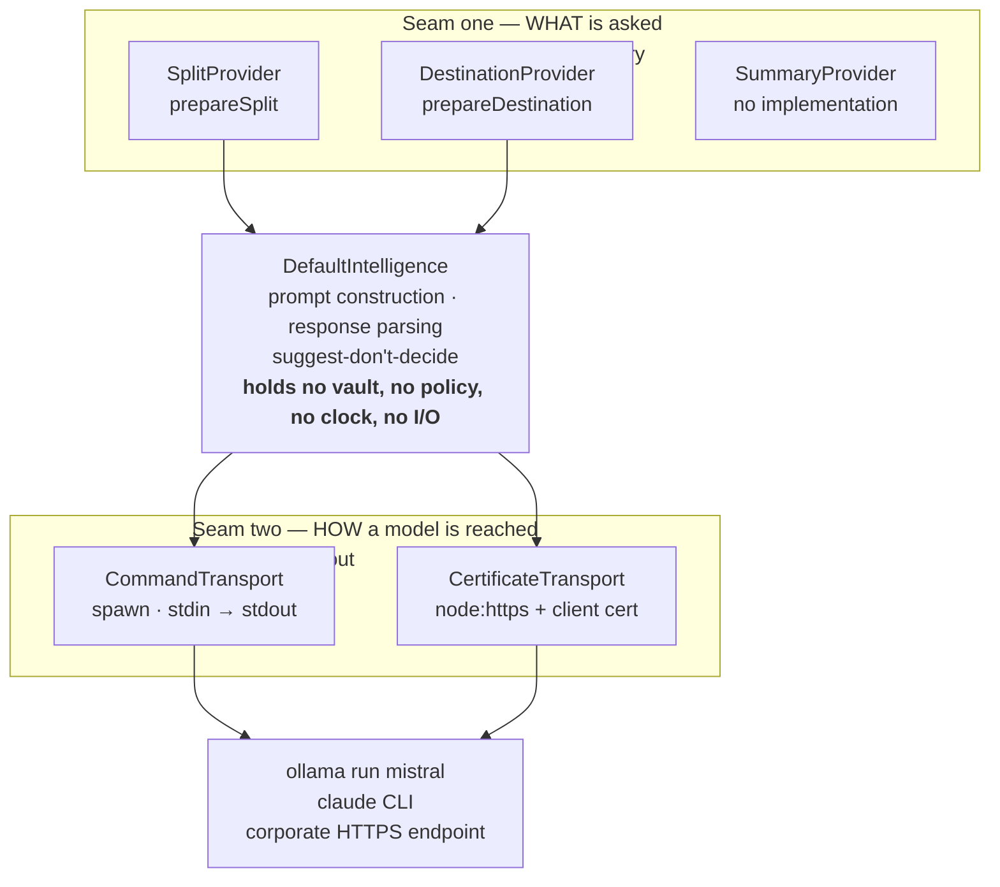
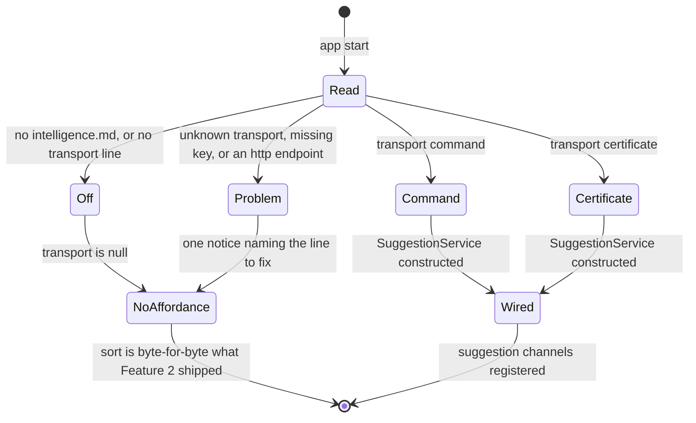
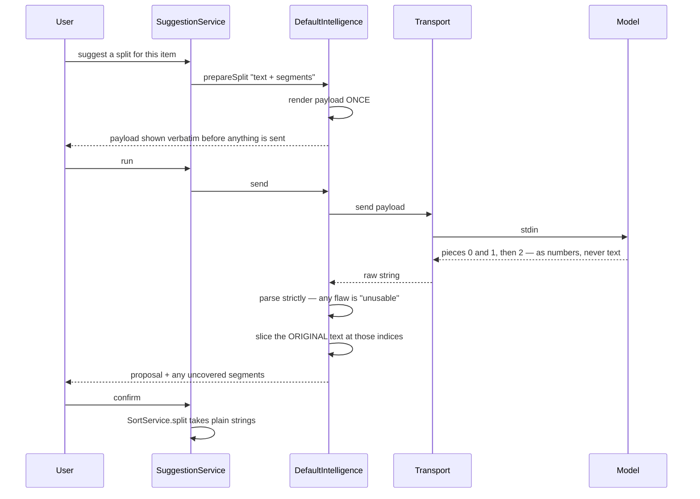
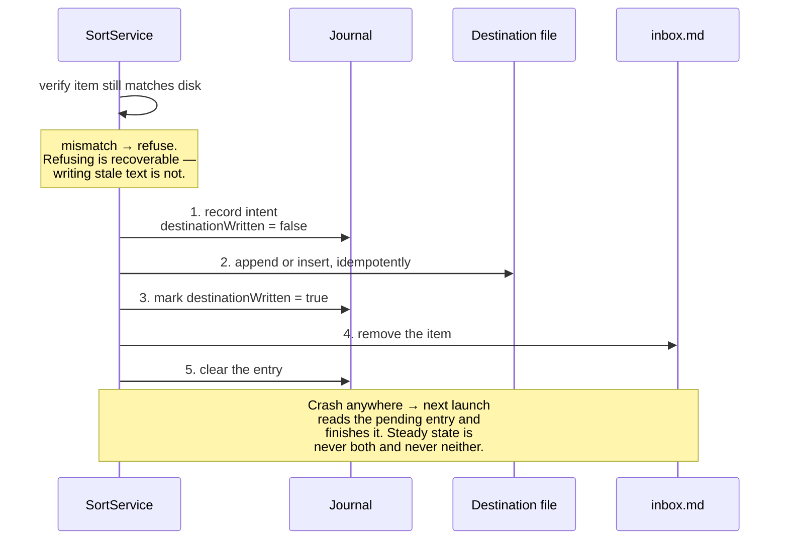
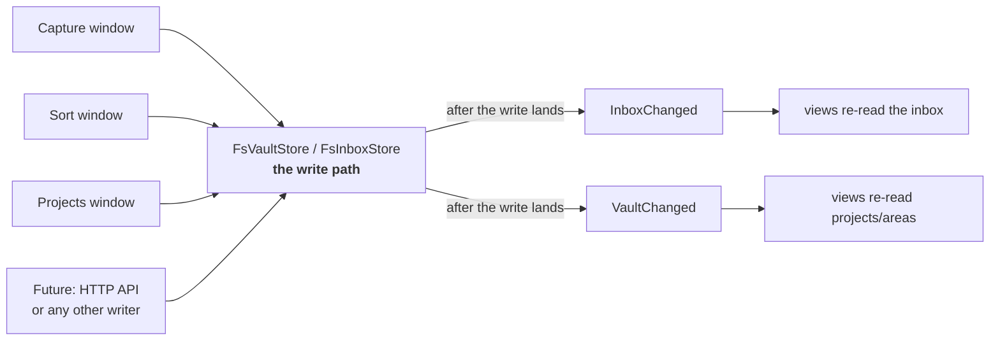

# Waypoint — Architecture

This document explains how Waypoint is built and, more importantly, *why*. It
assumes you can read TypeScript but have never seen this repository and know
none of its conventions. Every diagram is Mermaid, so it renders on GitHub and
stays diffable.

If you want to know what the app *does*, read [README.md](README.md). If you want
to know what is built and what is next, read [ROADMAP.md](ROADMAP.md). This file
is about structure and the reasoning behind it.

---

## 1. What Waypoint is, and the constraints that shaped it

Waypoint is a local-first, plain-text personal task system: quick capture,
inbox sorting, projects with milestones, a WIP limit, a weekly review ritual, a
retrospective view, and a daily shutdown. Today it ships as one Electron desktop
app. The architecture assumes it will not be the only client.

Three constraints did most of the design work. Nearly every decision below traces
back to one of them.

| Constraint | Where it came from | What it forced |
|---|---|---|
| **Two machines, one of them locked down** | Personal Ubuntu box runs anything; the work MacBook blocks npm/pip installs and many corporate libraries | Dependency-light everything, macOS builds only via CI, and a swappable *transport* for reaching a model |
| **The data must outlive the app** | A personal record-keeping tool that loses its data when it is abandoned is worthless | Plain-text markdown in a directory the application does not own, hand-editable with no app running |
| **Process must be enforced, not remembered** | Discipline that depends on the user remembering fails exactly when they are busiest | A policy seam *inside* core that no client can reach underneath |

---

## 2. Repository map

An npm workspaces monorepo with two packages. The dependency arrow only ever
points one way.



Two facts on that diagram are load-bearing:

- **`@waypoint/core` has no runtime dependencies at all.** Not a parser, not a
  date library, not an HTTP client. ISO-8601 week arithmetic is computed in-repo
  in [`weekly/iso-week.ts`](packages/core/src/weekly/iso-week.ts). This is
  what makes the "runs on the locked-down work machine" claim credible rather
  than hopeful.
- **The vault is not in this repo.** The app is a program; your data is a
  separate git repository you own. Deleting the app loses nothing.

---

## 3. The seven principles

These live in [`.specify/memory/constitution.md`](.specify/memory/constitution.md)
and are not decoration. Every feature plan carries a Constitution Check section,
and violations of I, III, IV, and V are **blocking**, not advisory.

| # | Principle | What it means in practice |
|---|---|---|
| I | **Test-First (non-negotiable)** | The test is written first and observed to fail *for the right reason*. Skipping "Red" is a constitution violation, not a style preference. |
| II | **Library-First** | All domain logic in core. Clients render, route input, and call verbs — nothing else. |
| III | **Local-First and Offline** | No core capability may depend on a network. Integrations are additive and optional. |
| IV | **Durable Plain-Text** | Markdown at rest, readable and editable with no app running. |
| V | **Enforced Process, Separable Policy** | Core declares *where* rules are consulted; a policy module decides *what* they are. |
| VI | **Instant, Non-Blocking Capture** | The capture box never waits on I/O. If capture hesitates, users route around it. |
| VII | **One Consistent Interaction Model** | No client invents a verb or a noun. New concepts land in core first. |

Principle V was amended once, from "The Core Enforces Process" (v1.0.0) to its
current form (v2.0.0), when the WIP limit revealed that some rules are *personal*
rather than domain-inherent. That amendment is why the policy seam exists at all.

---

## 4. Core and clients

Principle II drawn as a picture. Core is a pure library: it owns the rules and
holds no I/O. Everything that touches the outside world is an adapter injected
into it.



The renderer holds no notion of what a destination *is*; there is a test that
reviews for exactly that leakage. The IPC layer routes and serialises, and that
is all it does.

**Why this is worth the indirection:** a second client — a CLI, the deferred
HTTP API — inherits every rule for free, and cannot disagree with the desktop
app about any of them. That is Principle VII made structural instead of
documented.

---

## 5. The data model lives outside the application



**Configuration lives with the data, not with the application.** This is
Principle V's least obvious clause and one of the highest-leverage decisions in
the project. Because `policy.md` sits in the vault, any client opening that vault
loads identical rules *by construction*. Two clients cannot disagree about the
WIP limit, and your rules travel with your data between machines. No sync
protocol, no settings migration, no reconciliation.

A few format decisions worth knowing before you read a parser:

- **No YAML frontmatter.** Feature 2 had already shipped project stubs to real
  vaults; frontmatter would have meant rewriting every file on disk. Fields are
  added *beside* what exists. The rule generalises: **extend the file, never
  migrate it.**
- **Hand-written lines are first-class.** The inbox is a file you are expected to
  edit in vim. A line you typed sorts exactly like a dictated one, with no
  timestamp invented for it. Inbox zero means the file is genuinely empty — which
  matters, because the weekly review gates on it.
- **Derived state is never stored.** The "incomplete project" flag is computed at
  read time. A stored copy would go stale the first time you edited the file by
  hand, which is precisely the scenario plain text exists to support.

---

## 6. Ports and adapters

Core declares the interfaces it needs in a single file,
[`packages/core/src/ports/index.ts`](packages/core/src/ports/index.ts). The
desktop package implements them. Core never imports an adapter.



Two conventions in that diagram are unusual enough to call out:

**Injection is the boundary, and the boundary is enforced by signatures.**
`ShutdownServiceDeps` narrows its vault to `Pick<VaultStore, "read">`. A write
from the shutdown screen does not fail a test — it does not compile. Similarly,
`SuggestionService` receives a `catalog` that *cannot name a file*, so
`identity.md`, `policy.md`, and `log/` are unreachable from the LLM path by
construction rather than by review.

**A port with no implementation is a deliberate state.** `SummaryProvider` has
shipped since Feature 5 with no provider behind it. The weekly review completes
normally, offline, showing no summary affordance at all — not a disabled button,
not an error. Nothing is half-built; the absence is the shipped behaviour.

---

## 7. The policy seam

Core defines *what things are*. Policy defines *what should be allowed*. The
split test, from the decisions log: **a rule that could reasonably differ between
two users while both still use Waypoint correctly is policy.** "A project has
milestones" is core. "At most four of them" is policy.

Core declares exactly five named decision points and consults whatever module is
registered:



The five points are `project.status.change`, `project.milestone.add`,
`week.outcome.record`, `review.inbox.advance`, and `waiting.stale.check`.

**Why the seam is inside core rather than wrapped around it.** A policy layer
sitting *above* core would be bypassable by anything calling core directly — which
is exactly what the deferred HTTP API and the LLM layer do. Putting enforcement
at decision points *inside* core means nothing can reach underneath it. This is
the single reason the seam is where it is.

Three details a newcomer would otherwise misread:

- **`DECISION_POINTS` is exported as a value, not just a type, so the count is
  assertable.** Points are never declared speculatively. Feature 9 added a third
  *subject* to `waiting.stale.check` rather than a sixth point, and there is a
  test asserting the count did not change.
- **Verdicts are a closed set of three.** Nothing else is representable.
- **`warn` exists because refusals get routed around.** Marking a project done
  with open milestones *asks* instead of refusing — a hard block would be evaded
  by deleting the milestone, destroying its record. The confirmation is the
  honest version of the same guardrail.

---

## 8. Intelligence: two seams, deliberately asymmetric

There is no model client anywhere in Waypoint. No SDK, no provider dependency, no
HTTP client for any API. The LLM layer is split into two seams that know nothing
about each other.



Above the module, ports speak of projects and inbox items. Below it, a transport
carries a string and **has never heard of a project**. Moving from the home
machine to the locked-down work machine changes the transport and nothing else —
same prompts, same parsing, same semantics.

**The two extension points are asymmetric on purpose.** Adding a transport is
cheap and expected; it is the front door. Writing a second intelligence module is
for someone who disagrees with how the default one *thinks*, not merely with
where it connects. There is exactly one module, one factory, no loader, no
discovery, and no registration API — the same restraint Principle V imposes on
policy. An extension API is a promise that is expensive to take back.

### Configuration is read, never probed



The app **must not** check `PATH` for a CLI tool, probe for a listening local
model, read an environment variable, or detect an editor host. A machine with
`claude` on `PATH`, an Ollama listening on `11434`, and no `intelligence.md` has
the layer **off** — and [`suggest-no-probing.test.ts`](packages/core/tests/suggest-no-probing.test.ts)
sets all of those and asserts it. Auto-detection would make the app behave
differently on two machines for reasons the user cannot see, which is exactly
what plain-text configuration exists to prevent.

**Nothing in `intelligence.md` can become a secret.** `certificate`, `key`, and
`ca` are *paths*, resolved by the transport at call time. There is no field a
private key could be written into, which makes "the vault stays safe to commit" a
property of the format rather than a warning in the docs.

### The segment-number technique

The load-bearing idea, and the one most worth copying. The model is shown the
item cut into numbered segments and answers with **numbers**:



Because the response carries only indices, **text from the model is never
handled**. A piece containing words you did not say is not something a validator
catches — it is something the data path cannot produce. "Nothing dictated was
dropped" becomes set arithmetic over indices rather than a similarity score.

Parsing is strict and repairs nothing: bad JSON, a repeated index, an
out-of-range index, or a piece naming nothing all make the whole response
`unusable`. The single tolerance is stripping a markdown code fence, because that
wraps the payload rather than repairing it. Extracting "whatever can be
understood" would convert a visible failure into a quiet wrong answer, in your
own inbox.

And `SortService.split(ref, pieces)` takes **strings**, so it cannot tell whether
they came from a model proposal, an edited one, or a user typing three pieces by
hand. That signature is what makes "no behaviour exists only on the assisted
path" a fact rather than a policy.

---

## 9. Writing without losing a thought

POSIX cannot update two files atomically, and sorting an item means writing a
destination *and* removing it from the inbox. The commit is journalled.



Supporting decisions:

- **Verify before write.** The inbox may be open in an editor at the same moment.
  A decision re-checks that the item still matches disk and refuses on mismatch —
  mirroring the tail verification that capture's undo already uses.
- **Trash is a soft delete.** Sort runs fast and has no undo, so the single
  irreversible choice in the flow would be the one you make by mis-clicking.
  Items go to `trash.md`. It grows without bound, and pruning is deliberately
  nobody's job yet.
- **Every destination write is idempotent**, so replaying a step that already
  completed cannot duplicate a line.
- **Capture never blocks** (Principle VI). Appends go through a queue and a
  cross-window mutex; the box responds immediately regardless of disk latency.

---

## 10. Keeping windows honest

Seven windows can be open at once, over files you may also be editing in vim.
Two generic signals keep them coherent.



Three things make this work:

- **The signal is raised in the filesystem adapter's write path, never in an IPC
  handler.** A writer arriving later — the HTTP API, the LLM layer, a script —
  gets it for free, with nothing to remember and no view to teach.
- **They are generic about *cause* and specific about *subject*.** Neither says
  whether an outcome was edited or a status changed. They are separate emitters
  because `InboxChanged` fires on every capture, which for a projects window is
  pure noise.
- **Raised only after the write lands on disk.** A listener's whole job is to
  re-read; raising early would hand it pre-write state and teach it to distrust
  the signal.

One deliberate exception: the **shutdown window subscribes to nothing.**
Membership is fixed when the screen opens and an acted-on row updates in place
from the verb's own return value. A two-minute end-of-day review whose contents
shift underneath you is worse than a slightly stale one.

---

## 11. Conventions you would not guess from the code

This is the section to read before touching anything.

**Spec-driven development, one directory per feature.** Work starts in
`specs/NNN-slug/` with `spec.md` → `plan.md` → `tasks.md`, plus `research.md`,
`data-model.md`, `contracts/`, and `quickstart.md`. Code comments cite these by
requirement id — `FR-045`, `research R3` — and those citations resolve. When a
comment says "research R12", go read it; the reasoning is there.

**Spec history is append-only.** A shipped spec is amended with a dated note, never
rewritten. Superseded statements are left in place as historical record — you will
find explicitly wrong sentences in old specs, kept on purpose, with the correction
appended below them. Do not "clean these up."

**Deviations are recorded, not hidden.** Where the implementation departed from
its plan, the plan says so and says why. Feature 8's `propose()` becoming a
prepare/run pair and Feature 9 dropping a planned undo affordance are both written
down in their plans.

**Every feature gets a bare `NNN-slug` branch.** Never master.

**Tests assert absence as much as presence.** Of 236 core test files, more than
forty exist to prove something *is not there*:

| Test | What it forbids |
|---|---|
| `suggest-no-probing.test.ts` | Detecting a model from the environment |
| `sort-offline.test.ts` | Any network import reaching compiled core |
| `calendar-no-write-surface.test.ts` | A write verb existing for `calendar.md` |
| `project-scope-boundaries.test.ts` | HTTP leaking into core |
| `shutdown-writes-no-record.test.ts` | The shutdown leaving any trace of itself |
| `intelligence-config-no-secrets.test.ts` | A field that could hold key material |
| `*-parity-*.test.ts` | A surface refusing differently from another |

When you add a feature, the question "what must remain impossible?" is expected to
produce tests, not prose.

**The build machine rule.** All development happens on the personal Ubuntu
machine. The work MacBook never runs installs or compiles — macOS builds are
produced by GitHub Actions and downloaded as release artifacts. If you are
tempted to "just try it on the Mac", that is the rule you are breaking.

**Test-first is enforced socially and structurally.** Principle I is
non-negotiable and reviewers treat it as blocking. `tasks.md` orders tests before
implementation for this reason.

---

## 12. The trade-offs ledger

Every one of these bought something and cost something. The cost column is the
part usually left out of architecture docs.

| Decision | Bought | Paid |
|---|---|---|
| **Core has zero dependencies** | Runs anywhere, including the locked-down machine; trivially auditable | Hand-written ISO week arithmetic, parsers, and slug logic that libraries would have provided |
| **Plain-text, hand-editable data** | Data outlives the app; greppable; git-versioned | Every reader must tolerate a human having edited the file; no schema enforcement; verify-before-write everywhere |
| **Extend files, never migrate them** | No vault on disk ever breaks on upgrade | Formats accrete. No YAML frontmatter, ever, because stubs already shipped without it |
| **Policy inside core, not above it** | No client can bypass a rule; all clients agree by construction | Core must declare decision points up front, and each one is a permanent commitment |
| **One policy module, no plugin system** | The interface can still change freely | Third parties cannot extend it yet — deliberately |
| **Two intelligence seams** | Changing machines changes one config line | More indirection than a single "call the model" function; two interfaces to understand before reading either |
| **Transport configured, never probed** | Identical behaviour on every machine, for visible reasons | The user must write `intelligence.md` by hand. Nothing works out of the box, on purpose |
| **Model answers with segment numbers** | Fabricated text is structurally impossible, not merely detected | A stricter prompt contract; reasoning models that emit a preamble are rejected as `unusable` |
| **Strict parsing, no repair** | A failure is always visible | A near-miss response is thrown away entirely rather than salvaged |
| **Degrade-to-nothing** | No broken or disabled affordances ever | A user cannot tell "off" from "not built" without reading the config |
| **Journalled two-file commit** | A crash never loses or duplicates a thought | Five steps and a recovery path where one write would do |
| **Trash as soft delete** | Mis-clicks are recoverable | `trash.md` grows forever; pruning is nobody's job |
| **WIP limit counts only your own projects** | The rule stays credible for a manager overseeing many projects | `waiting` becomes an escape hatch that can quietly drain the limit of meaning — mitigated only by the stale check |
| **Computed flags, never stored** | Correct after a hand edit in vim | Recomputed on every read |
| **MIT license** | Preserves the open-core option the two-seam design creates | Permits a commercial fork of the core; accepted knowingly |
| **whisper.cpp over faster-whisper** | Dependency-light, self-contained binary, works where Python is blocked | Lower batch throughput, irrelevant for short captures |
| **`small.en` model** | Noticeably better accuracy than `base.en` | About 500 MB of bundle |
| **Electron** | One codebase, both platforms, fast to build | Large runtime for a text-file editor |

---

## 13. Where to start reading

In this order:

1. **[`.specify/memory/constitution.md`](.specify/memory/constitution.md)** — the seven principles. Everything else is downstream.
2. **[`packages/core/src/ports/index.ts`](packages/core/src/ports/index.ts)** — every interface core requires, heavily commented with the reasoning. The single best file for understanding the system's shape.
3. **[`ROADMAP.md`](ROADMAP.md)** — the architecture section, then the key decisions log. Long, and worth it.
4. **One service end to end** — [`sort/sort-service.ts`](packages/core/src/sort/sort-service.ts) with [`sort/commit.ts`](packages/core/src/sort/commit.ts) shows domain logic, the journal, and policy consultation together.
5. **[`packages/desktop/src/main/main.ts`](packages/desktop/src/main/main.ts)** — the composition root. Every adapter is constructed and injected here, and nowhere else.
6. **A `specs/NNN-slug/` directory** — pick a shipped one and read `spec.md` → `plan.md` → `tasks.md` to see how a feature actually gets built here.

Useful commands:

```bash
npm test        # build + run every core and desktop suite
npm run test:e2e   # Playwright against the real Electron app
npm run typecheck  # core build + both desktop projects
npm run dev        # launch the app
```
